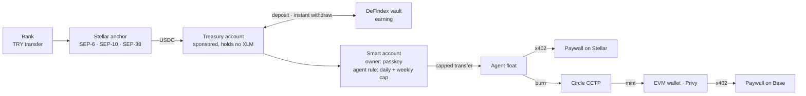
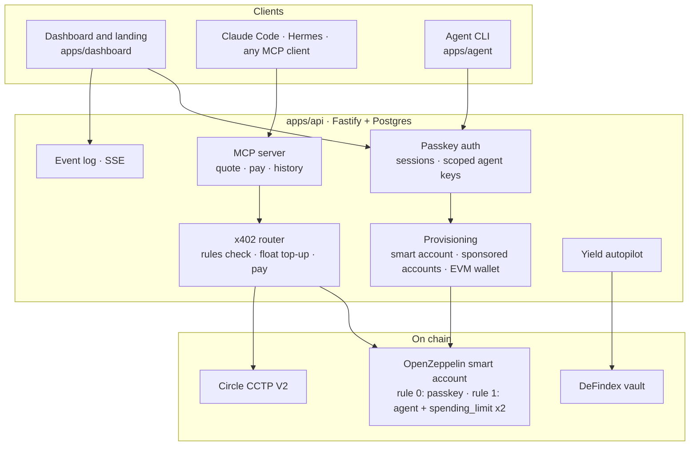

<p align="center">
  
</p>

<h3 align="center">Your lira earns. Your agent spends.</h3>

<p align="center">
  A wallet on Stellar where money keeps earning while an AI agent pays for what it needs,<br />
  inside limits that live in a smart contract.
</p>

<p align="center">
  <a href="https://perastellar.xyz">Live app</a> ·
  <a href="openapi.yaml">API contract</a> ·
  <a href="docs/DESIGN.md">Design notes</a> ·
  <a href="DEPLOYMENTS.md">Testnet deployments</a>
</p>

---

## What it is

AI agents have started paying for things: API calls, data, compute. Today you either hand an agent a key with no real limit, or you approve every payment by hand. Money set aside for the agent earns nothing, and getting from a bank account to USDC still means an exchange account and a seed phrase.

pera. closes those gaps in one product:

1. **Lira in.** A normal bank transfer goes through a Stellar anchor and lands as USDC.
2. **Money works.** Idle USDC moves into a DeFindex vault on its own and comes back the moment it is needed.
3. **The agent pays.** Claude Code, Hermes or any MCP client pays HTTP 402 paywalls over x402, natively on Stellar and on Base through Circle CCTP.
4. **Limits hold.** Daily and weekly spending caps are OpenZeppelin policy contracts on the user's smart account. Over the limit, the network rejects the transaction. No prompt can talk its way around that.
5. **One passkey.** Face ID or Touch ID owns the account. No seed phrase, no gas, no exchange account. Every fee is sponsored.

Everything runs on Stellar testnet and Base Sepolia with real transactions. Track: **Genesis**.

## How the money moves



The important hop is the one in the middle. The agent's key is not a wallet owner. It is a restricted signer on the smart account, allowed to do exactly one thing: move USDC into its own small float account, and only as much as the on-chain policies allow. A fully compromised agent key still cannot spend past the cap.

## Architecture



## Where each rule is enforced

| Rule | Enforced by | How a change is approved |
|---|---|---|
| Daily limit | `spending_limit` policy contract, rolling 17,280 ledgers | Passkey-signed transaction |
| Weekly limit | second `spending_limit` instance, rolling 120,960 ledgers | Passkey-signed transaction |
| Max per call | pera router, before anything is signed | Passkey assertion |
| Allowed chains | pera router, before anything is signed | Passkey assertion |
| Agent key scopes (`read`, `pay`) | API | Owner session only |

The two contract rules cannot be bypassed by the backend. The router rules protect against an agent paying a paywall you did not intend, and every change to them needs the owner's passkey.

## Built on

| Piece | Where | Notes |
|---|---|---|
| Stellar anchor, SEP-1, 6, 10, 12, 38 | `packages/anchor` | `tr-mock-anchor.fly.dev`, deposit and withdraw, sandbox bank transfer |
| OpenZeppelin smart accounts | `packages/smart-account` | `smart-account-kit`, passkey owner, agent signer, two `spending_limit` policies |
| x402 v2 | `packages/x402-router`, `apps/resource-server` | native Stellar payments, fees sponsored by the facilitator |
| Circle CCTP V2 | `packages/cctp` | Stellar domain 27 to Base Sepolia domain 6, native burn and mint |
| DeFindex | `packages/yield` | own vault on the Circle USDC contract, per-user shares, autopilot |
| Passkeys, WebAuthn | `packages/passkey` | one-press sign-in with immediate mediation where the browser supports it |
| Privy server wallets | `packages/evm` | EVM wallet per user, gas sponsored on Base Sepolia |
| Sponsored reserves | `packages/core` | user accounts are created with 0 XLM |
| MCP | `apps/api/src/mcp`, `apps/mcp-shim` | remote Streamable HTTP server plus a stdio shim |

## Repository

pnpm workspace, TypeScript everywhere, `tsx` at runtime.

```
apps/dashboard          landing page, passkey onboarding, dashboard (home, rules, agents, analytics)
apps/api                REST API, MCP server, provisioning, event stream (see openapi.yaml)
apps/resource-server    x402 paywalls for testing: Stellar, Base, either
apps/agent              CLI agent and a software passkey for headless end-to-end runs
apps/mcp-shim           @pera/mcp, a stdio shim for clients without HTTP transport
apps/web                reference browser client
packages/core           env, constants, amounts, event bus, Stellar helpers
packages/db             Postgres (PGlite in dev), migrations, encrypted secrets
packages/passkey        WebAuthn verification, software passkey
packages/anchor         SEP client: on-ramp, off-ramp
packages/smart-account  smart account deploy, agent rule, policies, capped top-up
packages/yield          DeFindex vault, autopilot, instant liquidity
packages/evm            Privy wallets, sponsored calls, x402 signer
packages/cctp           burn on Stellar, attestation, mint on Base
packages/x402-router    payFor(url): probe, check rules, top up, pay
integrations/hermes     Hermes Agent kit
scripts/                keys, bootstrap, smoke tests, bank simulator, OpenAPI generator
```

## Run it

Node 22 and pnpm 10.

```bash
corepack enable && pnpm install
pnpm keys                 # writes .env with a sponsor key
# add PRIVY_APP_ID and PRIVY_APP_SECRET; DEFINDEX_API_KEY is optional
pnpm bootstrap            # funds the sponsor, creates the vault

pnpm dev:api              # API on :3000 (embedded PGlite unless DATABASE_URL is set)
pnpm dev:rs               # test paywalls on :4000
pnpm dev:dashboard        # landing and dashboard on :5174
```

Open `http://localhost:5174`, press **Launch app**, then **Continue**. One passkey prompt creates the wallet.

### Add lira

The dashboard shows an IBAN and a reference. Play the bank from a terminal:

```bash
pnpm bank TR050009900000000000000001 TRMA-XXXX-XXXX 3000
```

The anchor pays USDC, the dashboard updates on its own, and the idle part moves into the vault.

### Let an agent pay

Create a key on the Agents page, then connect a client. Claude Code:

```bash
claude mcp add --transport http pera http://localhost:3000/mcp \
  --header "Authorization: Bearer pat_your-key"
```

Or call the API directly:

```bash
curl localhost:3000/agent/pay -H "authorization: Bearer pat_your-key" \
  -H 'content-type: application/json' \
  -d '{"url":"http://localhost:4000/api/stellar/weather"}'
```

Third-party paywalls work too, for example the SDF demo at `https://stellar.org/x402-demo/api/weather/testnet?city=Istanbul`.

### Check everything

```bash
pnpm typecheck && pnpm test
pnpm smoke:mcp            # keys, tools, quote, a real x402 payment, approvals, scope denial
pnpm agent over-cap       # asks for more than the limit; the contract answers #3221
```

## Status

| Working on testnet | Depends on others |
|---|---|
| Passkey accounts, one-press sign-in | Base route needs Circle's sandbox attestation service to be up |
| Anchor on-ramp, automatic vault deposit | Vault yield is zero on testnet: the vault holds funds idle, no strategy is attached |
| Daily and weekly limits on chain, passkey-signed changes | |
| x402 payments on Stellar, including third-party paywalls | |
| MCP server, scoped agent keys, approval flow in the API | |

## Skills used

Installed locally and consulted while building:

- `stellar-dev` from `github.com/stellar/stellar-dev-skill`: agentic payments and x402, standards, cross-chain and CCTP, smart contracts
- `stellar-anchor` from `github.com/CheesecakeLabs/stellar-anchor-skill`
- `defindex` from `github.com/defindex-io/defindex-skill`

## More

- [Design notes](docs/DESIGN.md): custody, why the agent pays from a float account, trade-offs, what was hard
- [API and MCP reference](docs/API.md)
- [Testnet deployments](DEPLOYMENTS.md): contracts and transaction hashes
- [Deploy guide](DEPLOY.md)

## Team

Built in 36 hours at the Rise In x Stellar Pro Hackathon, Istanbul.

- Barış Bice: product, design, frontend
- Feyyaz ([@feyyazcigim](https://github.com/feyyazcigim)): backend, contracts
- Ömer Furkan Yürük: research, strategy
