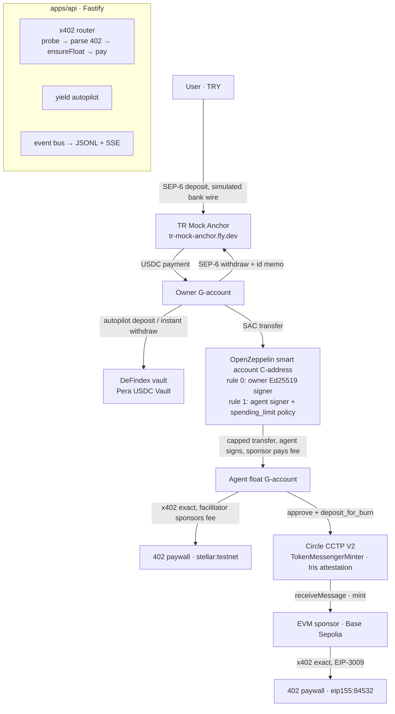

# Pera Agent Wallet

**An AI-agent wallet on Stellar for Turkish users.** Lira goes in through a TRY anchor, idle USDC earns in a
DeFindex vault, and an AI agent pays HTTP‑402 (x402) paywalls on Stellar — or on Base via Circle CCTP — from a
smart account whose **daily spending cap is enforced on-chain by an OpenZeppelin policy contract**. Even a fully
compromised agent key cannot spend more than the cap.

Everything below runs on **Stellar testnet** with real transactions; nothing on the happy path is mocked.

| | |
|---|---|
| Track | Genesis |
| Live API | `PUBLIC_API_URL` (see [DEPLOY.md](DEPLOY.md)) — `GET /status` is public |
| Resource server (paywalls) | `RESOURCE_SERVER_URL` — `GET /api/stellar/weather` returns 402 |
| Deployed artefacts | [DEPLOYMENTS.md](DEPLOYMENTS.md) (auto-appended by every script) |
| API contract | [openapi.yaml](openapi.yaml) (also served at `/openapi.yaml`) |

## The problem

Turkish users who want an AI agent to buy data, APIs or services for them face three gaps: getting lira into a
form an agent can spend, keeping the money productive while it sits idle, and — above all — **trusting an agent
with a private key**. Pera answers all three: SEP‑6 on-ramp, automatic DeFindex yield, and an agent key that is
a *restricted signer* of a smart account, not a wallet owner.

## What the demo shows

1. **On-ramp** — 200 TRY through `tr-mock-anchor` (SEP‑1/10/12/38/6). USDC lands on the owner's Stellar account.
2. **Auto-yield** — the autopilot deposits everything above a reserve into a DeFindex vault; withdrawals are
   instant and happen inline when the agent needs liquidity.
3. **Capped agent** — the agent tops up its float from the smart account under a `spending_limit` policy
   (10 USDC / rolling 24 h). A 3 USDC top-up succeeds; a 15 USDC attempt is **rejected by the policy contract**
   (`Error(Contract, #3221) SpendingLimitExceeded`).
4. **x402 on Stellar** — the agent hits a paywalled weather API, gets a 402, pays 0.01 USDC natively, receives
   live Istanbul weather. The facilitator sponsors the network fee, so the float holds USDC only.
5. **x402 on Base Sepolia** — the agent hits an `eip155:84532` paywall, burns USDC on Stellar through **Circle
   CCTP V2**, waits for the Iris attestation, mints on Base and pays with the EVM exact scheme.
6. **Off-ramp** — USDC back to TRY through the same anchor (SEP‑6 withdraw with an id memo).

## Architecture



**Design decision: vault-fronts-float.** `@x402/stellar` cannot use a C-address as the payer today — the client
forces an Ed25519 signature shape, the reference facilitator rejects policy events during simulation, and its fee
ceiling refuses `__check_auth` calls that touch other contracts (x402-foundation/x402 issues
[#3158](https://github.com/x402-foundation/x402/issues/3158), [#3352](https://github.com/x402-foundation/x402/issues/3352),
[#3515](https://github.com/x402-foundation/x402/issues/3515), all open). So the bulk of the funds stays in the
smart account and the vault, the agent owns a tiny classic *float* account, and the **only** path from the smart
account to the float is a USDC `transfer` that the agent's Ed25519 signer can authorise **under the on-chain
spending cap**. The agent then pays x402 from the float like any classic payer. The security story stays fully
on-chain: the cap is enforced inside the smart account's `__check_auth`, not by our backend.

## Stellar integrations used

| Integration | Where | Notes |
|---|---|---|
| **tr-mock-anchor** (SEP‑1, 10, 12, 38, 6) | `packages/anchor` | `@stellar/typescript-wallet-sdk` 5.0.0; sandbox `simulate-bank-transfer`; SEP‑38 rate shown in `/status` |
| **OpenZeppelin smart accounts** via `smart-account-kit` 0.8.0 + `stellar-accounts` policies | `packages/smart-account` | Ed25519 owner + agent signers, `CallContract(USDC)` rule, `spending_limit` policy `CABXBYJN…TIP5G` |
| **DeFindex** (hosted API, unsigned-XDR pattern) | `packages/yield` | own vault on the Circle USDC SAC created through the factory; deposit / withdraw / balance / APY |
| **Circle CCTP V2** (Stellar domain 27 → Base Sepolia domain 6) | `packages/cctp` | `deposit_for_burn` on `CDNG7HX…RTHP`, Iris sandbox attestation, `MessageTransmitterV2.receiveMessage` via viem |
| **x402 v2** (`@x402/core|stellar|evm|express` 2.26.0) | `packages/x402-router`, `apps/resource-server` | facilitator `https://x402.org/facilitator` (Stellar fees sponsored, also serves `eip155:84532`); OpenZeppelin facilitator optional via `OZ_FACILITATOR_API_KEY` |

## Skills used

Installed locally and consulted while building (paths as required by the handbook):

- `~/.claude/skills/stellar-dev` ← `github.com/stellar/stellar-dev-skill`:
  `skills/agentic-payments/SKILL.md` + `skills/agentic-payments/x402.md`, `skills/standards/SKILL.md`,
  `skills/cross-chain/SKILL.md` + `skills/cross-chain/cctp.md`, `skills/smart-contracts/SKILL.md`
- `~/.claude/skills/stellar-anchor/SKILL.md` ← `github.com/CheesecakeLabs/stellar-anchor-skill`
- `~/.claude/skills/defindex/SKILL.md` (+ `auth.md`, `endpoints.md`) ← `github.com/defindex-io/defindex-skill`
  (the DeFindex skill lives in DeFindex's own repo, not in `stellar-dev-skill`)

## Deployed artefacts (testnet)

Taken from [DEPLOYMENTS.md](DEPLOYMENTS.md); the file is the source of truth.

| What | Id / hash |
|---|---|
| Smart account (OpenZeppelin) | [`CADQORKGPDAYDSU434DOBGHXU73CW7S7P2W4EBHLD7V2ON266XOOLULP`](https://stellar.expert/explorer/testnet/contract/CADQORKGPDAYDSU434DOBGHXU73CW7S7P2W4EBHLD7V2ON266XOOLULP) — deploy tx [`b0f56fef…`](https://stellar.expert/explorer/testnet/tx/b0f56fef769215c37c0956a04755604904b5df827dec504f626b5f527edc1a75) |
| Agent context rule #1 (`CallContract(USDC)` + `spending_limit` 10 USDC / 17 280 ledgers) | tx [`9c7eaff6…`](https://stellar.expert/explorer/testnet/tx/9c7eaff6c452454e16eacfa144c212fb66c65b1501f6b12c06499c71bd97deec) |
| spending_limit policy contract (OpenZeppelin) | [`CABXBYJNZ7IUW4G3D6BND5YCAQF3ASSDMDAOKQQ63UYFSO7WUU2TIP5G`](https://stellar.expert/explorer/testnet/contract/CABXBYJNZ7IUW4G3D6BND5YCAQF3ASSDMDAOKQQ63UYFSO7WUU2TIP5G) |
| Owner G-account | [`GDEIIJVYMY4DQJI5HFCM4ES52GWT6SDRBD3SPXUEPN3D3D7ZUATXTZ7Z`](https://stellar.expert/explorer/testnet/account/GDEIIJVYMY4DQJI5HFCM4ES52GWT6SDRBD3SPXUEPN3D3D7ZUATXTZ7Z) |
| Agent signer / float G-account | [`GARNESX3P3EYK7L5724TO6TIT7KRSX7B2XTIZHBKVMVAZQK4IRS6R2GI`](https://stellar.expert/explorer/testnet/account/GARNESX3P3EYK7L5724TO6TIT7KRSX7B2XTIZHBKVMVAZQK4IRS6R2GI) |
| Anchor on-ramp 200 TRY → 4.079 USDC | [`d22c97a4…`](https://stellar.expert/explorer/testnet/tx/d22c97a41c8650821271209d809c16d55a05a6b820441f41f3d4a0157efe7201) |
| Capped top-up 3 USDC (succeeds) | [`2d34e226…`](https://stellar.expert/explorer/testnet/tx/2d34e2267384504505e9231cace0c52cd8d180035a85241ac4d451395a456216) |
| Over-cap 15 USDC (rejected, `#3221 SpendingLimitExceeded`) | reproducible: `pnpm agent over-cap` / `POST /agent/pay/over-cap-demo` |
| x402 payment 0.01 USDC on Stellar | [`ab0a1603…`](https://stellar.expert/explorer/testnet/tx/ab0a1603a69b3604a35c6a06627385fa1f3337d29fefe0d203c0307fd557151f) |
| DeFindex vault / CCTP burn + mint / Base payment | appended to DEPLOYMENTS.md by `pnpm bootstrap` and `pnpm smoke:pay` once `DEFINDEX_API_KEY` and Base Sepolia ETH are available |

## Repository

pnpm workspace, TypeScript everywhere, `tsx` at runtime (no build step).

```
packages/core            env (zod), constants, amounts (BigInt), event bus (ring + JSONL), Soroban/Horizon helpers
packages/anchor          SEP-1/10/12/38/6 client — on-ramp, off-ramp, quotes
packages/smart-account   smart account deploy (bindings), attach, agent rule + policy, capped top-up, policy usage
packages/yield           DeFindex vault create/resolve, deposit/withdraw/position, autopilot + ensureLiquidity
packages/cctp            approve + deposit_for_burn, Iris polling, receiveMessage on Base, bridgeToBase
packages/x402-router     payFor(url): probe → parse 402 → ensureFloat cascade → pay (Stellar native | CCTP + EVM)
apps/api                 Fastify REST API + SSE for the dashboard (see openapi.yaml)
apps/agent               CLI that plays the agent (run / pay / over-cap / policy / balances)
apps/resource-server     three x402 paywalls (stellar, base, both)
scripts/                 keys, bootstrap, onramp/policy/yield/pay smoke tests, demo, gen-openapi
```

## Run it in five minutes

```bash
corepack enable && pnpm install
pnpm keys                      # generates .env with 3 Stellar keys + 1 EVM key, prints addresses
# optional: DEFINDEX_API_KEY=sk_… (console.defindex.io) and Base Sepolia ETH for the printed EVM address
pnpm bootstrap                 # friendbot, trustlines, smart account + rule, vault, on-ramp, funding, pre-bridge
pnpm dev:rs                    # paywalls on :4000
pnpm dev:api                   # API on :3000 (bearer = API_BEARER_TOKEN)

pnpm smoke:onramp              # checkpoint 1 — TRY → USDC
pnpm smoke:policy              # checkpoint 2 — 3 USDC ok, 15 USDC rejected on-chain (#3221)
pnpm smoke:yield               # checkpoint 3 — deposit 10 / withdraw 4 (needs DEFINDEX_API_KEY)
pnpm smoke:pay                 # checkpoint 4 — x402 on Stellar, then Base Sepolia via CCTP
pnpm agent run --task "istanbul weather and a summary"
pnpm agent over-cap            # exits 2 with the policy rejection
pnpm demo                      # the pitch sequence, narrated
```

Useful checks: `curl $API/status`, `curl -H "Authorization: Bearer $T" $API/balances`,
`curl -N "$API/events/stream?token=$T"` (live timeline), `pnpm typecheck && pnpm test`.

## REST API (for the dashboard)

All amounts are decimal USDC strings. Auth is a static bearer token; `/status` and `/health` are public and
`/events/stream` also accepts `?token=`. Full schema in [openapi.yaml](openapi.yaml).

| Method | Path | Purpose |
|---|---|---|
| GET | `/status` | network, smart account, vault, agent, cap, Base sponsor, facilitator |
| GET | `/balances` | owner, float, smart account, vault position, Base USDC/ETH |
| POST | `/onramp` `{amountTry}` | SEP‑6 deposit + simulated wire → `202 {anchorTxId}` |
| GET | `/onramp/:id` | anchor transaction passthrough |
| POST | `/offramp` `{amountUsdc}` | vault → owner if needed, SEP‑6 withdraw |
| POST | `/yield/deposit` · `/yield/withdraw` `{amountUsdc}` | manual vault ops |
| GET | `/yield/position` | shares, underlying, APY |
| GET · POST | `/agent/policy` | cap/used/remaining read from the policy contract · owner sets a new cap |
| POST | `/agent/pay` `{url, prefer?}` | runs the router; returns body + tx hashes + event timeline |
| POST | `/agent/pay/over-cap-demo` | attempts an over-cap top-up; returns the on-chain rejection |
| GET | `/events` · `/events/stream` | last 200 events · Server-Sent Events |

Event types: `onramp.started|completed`, `yield.deposited|withdrawn`, `float.topup|topup.rejected`,
`x402.402|paid`, `bridge.burned|attested|minted`, `offramp.completed` — persisted to an append-only JSONL file.

## Design decisions and trade-offs

- **Vault-fronts-float** (above). Pure C-address x402 payment is a roadmap item, blocked by the linked issues.
- **Owner G-account is the DeFindex depositor.** The hosted API returns `operationXDR` for C-address callers;
  using the owner key keeps the flow to one signed XDR. The smart account only holds the agent's capped source.
- **Sponsor-paid fees instead of the public relayer.** The testnet relayer proxy only accepts passkey-shaped
  deploys; our backend key (`SPONSOR_SECRET`) is the kit's `deployerSecret`, so it sources and pays every
  smart-account transaction. The agent key never needs XLM for smart-account operations.
- **Ed25519 owner, no passkeys.** `smart-account-kit` only deploys passkey-owned accounts, so we deploy through
  the generated bindings with an Ed25519 External signer on rule 0 and attach the kit afterwards (canary-tested).
- **No recipient allowlist.** OpenZeppelin's policies are `simple_threshold`, `weighted_threshold` and
  `spending_limit`; the latter meters `transfer` amounts but ignores `to`. The amount cap is the load-bearing
  control; a recipient-restricting policy is on the roadmap.
- **Own vault, zero strategies on testnet.** DeFindex's testnet Blend USDC strategy is denominated in a different
  test asset (BlendUSDC) than the anchor's USDC, so we create our own vault on the Circle USDC SAC. The vault
  contract accepts an asset with no strategies (deposits stay idle), which keeps deposit/withdraw/shares real
  while yield is zero on testnet. Mainnet roadmap: DeFindex's Blend USDC autocompound strategy.
- **CCTP over Near Intents / Allbridge.** Native USDC in, native USDC out, no liquidity assumptions. Near Intents
  is the roadmap path for non-USDC assets on mainnet.
- **`x402.org` facilitator for both networks.** It sponsors Stellar fees and serves Base Sepolia without a key;
  the OpenZeppelin facilitator is wired in as an optional second client.

## Technical challenges

- `@x402/stellar` C-address payer limitation (issues #3158 / #3352 / #3515) → vault-fronts-float.
- Two testnet USDCs: the DeFindex Blend strategy wants BlendUSDC, the anchor pays Circle USDC → own vault.
- `smart-account-kit` is passkey-only for deploy/connect in 0.8.0 → bindings deploy + headless attach.
- `spending_limit` only meters the `transfer` context and must be installed on a `CallContract` rule at rule
  creation time; the kit's `transfer()` takes whole units while the policy limit is in stroops.
- Two `@stellar/stellar-sdk` majors coexist (wallet-sdk pins 17.0.1, kit and x402 need ^16.3): packages exchange
  strings only, never SDK objects.
- CCTP amounts are 6-decimal while Stellar USDC has 7 → burn amounts are rounded down to multiples of 10 stroops;
  Iris attestation latency is hidden by pre-bridging at bootstrap and narrating progress over SSE.
- Over-cap rejections happen at simulation (Soroban evaluates the policy against live ledger state), so the
  artefact is the decoded `#3221` plus the policy contract — reproducible on demand from the dashboard.

## Roadmap (SCF / InstAward)

1. Mainnet TRY anchor (same SEP‑6 client, new home domain and USDC issuer).
2. Pure smart-account x402 payer once the client/facilitator issues land; escrow contract for facilitator-fronted
   payments (`lock / release / refund` keyed by the CCTP attestation).
3. Recipient-allowlist policy for the agent rule; per-merchant budgets.
4. Passkey onboarding for the owner (kit-native), Solvador as multi-chain facilitator, Near Intents for non-USDC.
5. LLM-driven planner (MCP tool) in `apps/agent`.

## Deployment

See [DEPLOY.md](DEPLOY.md) — two Dokploy Applications (Nixpacks) from this repo.
