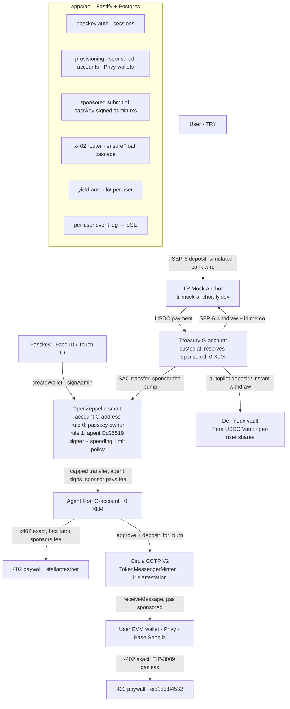

# Pera Agent Wallet

**A multi-user AI-agent wallet on Stellar for Turkish users.** A user signs up with a **passkey**; that passkey
owns an **OpenZeppelin smart account** created headlessly on Stellar, and the backend provisions a sponsored
treasury account, an agent session key and an **EVM wallet (Privy)** for them. Lira goes in through a TRY anchor,
idle USDC earns in a DeFindex vault, and the user's AI agent pays HTTP‑402 (x402) paywalls on Stellar — or on Base
via Circle CCTP — under a **daily spending cap enforced on-chain by an OpenZeppelin policy contract** that the owner
approves with their passkey. Even a fully compromised agent key cannot spend more than the cap, and the user never
holds XLM or ETH: every fee is sponsored.

Everything below runs on **Stellar testnet / Base Sepolia** with real transactions; nothing on the happy path is mocked.

| | |
|---|---|
| Track | Genesis |
| Live API | `PUBLIC_API_URL` (see [DEPLOY.md](DEPLOY.md)) — `GET /status` is public |
| Resource server (paywalls) | `RESOURCE_SERVER_URL` — `GET /api/stellar/weather` returns 402 |
| Deployed artefacts | [DEPLOYMENTS.md](DEPLOYMENTS.md) (auto-appended by every script) |
| API contract | [openapi.yaml](openapi.yaml) (also served at `/openapi.yaml`) |

## The problem

Turkish users who want an AI agent to buy data, APIs or services for them face three gaps: getting lira into a
form an agent can spend, keeping the money productive while it sits idle, and — above all — **trusting an agent
with a private key**. Pera answers all three: SEP‑6 on-ramp, automatic DeFindex yield, and an agent key that is
a *restricted signer* of a smart account, not a wallet owner.

## What the demo shows

0. **Passkey sign-up** — the dashboard calls `smart-account-kit`'s `createWallet()` (Face ID / Touch ID), posts the
   passkey + deploy payload to `POST /auth/register`; the API deploys the smart account with the sponsor key, verifies
   the passkey owns rule 0, then creates the user's **treasury** and **agent** Stellar accounts with *sponsored reserves*
   (0 XLM) and an **EVM wallet** (Privy server wallet with gas sponsorship, or a local key relayed by the sponsor).
   Login is a standard WebAuthn assertion verified by the API (challenge + origin + rpId + P‑256 signature).
1. **Agent approval** — the owner signs `add_context_rule` (agent signer + `spending_limit` policy) with the passkey in
   the browser; the API re-simulates and submits it sponsored. Changing the cap is the same two-step flow
   (`set_spending_limit` through the smart account's `execute`).
2. **On-ramp** — 200 TRY through `tr-mock-anchor` (SEP‑1/10/12/38/6). USDC lands on the user's treasury account.
3. **Auto-yield** — the autopilot deposits everything above a reserve from each user's treasury into the shared
   DeFindex vault (per-user shares); withdrawals are instant and happen inline when the agent needs liquidity.
4. **Capped agent** — the agent tops up its float from the smart account under the `spending_limit` policy
   (10 USDC / rolling 24 h). A 0.51 USDC top-up succeeds; an attempt above the remaining cap is **rejected by the
   policy contract** (`Error(Contract, #3221) SpendingLimitExceeded`). Usage is read back from the policy's on-chain state.
5. **x402 on Stellar** — the agent hits a paywalled weather API, gets a 402, pays 0.01 USDC natively from its float,
   receives live Istanbul weather. The facilitator sponsors the network fee, so the float holds USDC only.
6. **x402 on Base Sepolia** — the agent hits an `eip155:84532` paywall, burns USDC on Stellar through **Circle
   CCTP V2**, waits for the Iris attestation, mints to the user's EVM wallet (`receiveMessage` gas sponsored) and
   pays with the EVM exact scheme (EIP‑3009, gasless).
7. **Off-ramp** — USDC back to TRY through the same anchor (SEP‑6 withdraw with an id memo; sponsor pays the fee).

## Architecture



**Key custody.** The smart account owner is the user's passkey — it never leaves the device. The backend keeps two
custodial Ed25519 keys per user (treasury, agent), AES‑256‑GCM encrypted in Postgres under `WALLET_MASTER_KEY`; the
agent key is worthless beyond the on-chain cap, and the treasury key can only ever move funds *into* the smart
account, the vault or the anchor off-ramp. EVM keys live in Privy's TEE (or, without Privy credentials, encrypted
locally). Roadmap: move the custodial Stellar keys into Privy raw-sign wallets too.

**Design decision: vault-fronts-float.** `@x402/stellar` cannot use a C-address as the payer today — the client
forces an Ed25519 signature shape, the reference facilitator rejects policy events during simulation, and its fee
ceiling refuses `__check_auth` calls that touch other contracts (x402-foundation/x402 issues
[#3158](https://github.com/x402-foundation/x402/issues/3158), [#3352](https://github.com/x402-foundation/x402/issues/3352),
[#3515](https://github.com/x402-foundation/x402/issues/3515), all open). So the bulk of the funds stays in the
smart account and the vault, the agent owns a tiny classic *float* account, and the **only** path from the smart
account to the float is a USDC `transfer` that the agent's Ed25519 signer can authorise **under the on-chain
spending cap**. The agent then pays x402 from the float like any classic payer. The security story stays fully
on-chain: the cap is enforced inside the smart account's `__check_auth`, not by our backend.

## Stellar integrations used

| Integration | Where | Notes |
|---|---|---|
| **tr-mock-anchor** (SEP‑1, 10, 12, 38, 6) | `packages/anchor` | `@stellar/typescript-wallet-sdk` 5.0.0; sandbox `simulate-bank-transfer`; SEP‑38 rate shown in `/status` |
| **OpenZeppelin smart accounts** via `smart-account-kit` 0.8.0 + `stellar-accounts` policies | `packages/smart-account` | Ed25519 owner + agent signers, `CallContract(USDC)` rule, `spending_limit` policy `CABXBYJN…TIP5G` |
| **DeFindex** (hosted API, unsigned-XDR pattern) | `packages/yield` | own vault on the Circle USDC SAC created through the factory; deposit / withdraw / balance / APY |
| **Circle CCTP V2** (Stellar domain 27 → Base Sepolia domain 6) | `packages/cctp` | `deposit_for_burn` on `CDNG7HX…RTHP`, Iris sandbox attestation, `MessageTransmitterV2.receiveMessage` via viem |
| **x402 v2** (`@x402/core|stellar|evm|express` 2.26.0) | `packages/x402-router`, `apps/resource-server` | facilitator `https://x402.org/facilitator` (Stellar fees sponsored, also serves `eip155:84532`); OpenZeppelin facilitator optional via `OZ_FACILITATOR_API_KEY` |
| **Passkeys / WebAuthn** (`smart-account-kit` in the browser + own verifier) | `packages/passkey`, `apps/web`, `apps/agent` | assertion verified with WebCrypto against the on-chain owner key; software passkey for headless tests |
| **Privy server wallets + gas sponsorship** (`@privy-io/node` 0.34) | `packages/evm` | `sponsor: true` (EIP‑7702 + paymaster) on Base Sepolia; ERC‑1271 typed-data mode for x402; falls back to local keys + sponsor EOA relay without credentials |
| **Sponsored reserves on Stellar** | `packages/core` | `beginSponsoringFutureReserves` + `createAccount(0)` + trustline: user accounts hold no XLM |

## Skills used

Installed locally and consulted while building (paths as required by the handbook):

- `~/.claude/skills/stellar-dev` ← `github.com/stellar/stellar-dev-skill`:
  `skills/agentic-payments/SKILL.md` + `skills/agentic-payments/x402.md`, `skills/standards/SKILL.md`,
  `skills/cross-chain/SKILL.md` + `skills/cross-chain/cctp.md`, `skills/smart-contracts/SKILL.md`
- `~/.claude/skills/stellar-anchor/SKILL.md` ← `github.com/CheesecakeLabs/stellar-anchor-skill`
- `~/.claude/skills/defindex/SKILL.md` (+ `auth.md`, `endpoints.md`) ← `github.com/defindex-io/defindex-skill`
  (the DeFindex skill lives in DeFindex's own repo, not in `stellar-dev-skill`)

## Deployed artefacts (testnet)

Taken from [DEPLOYMENTS.md](DEPLOYMENTS.md); the file is the source of truth.

| What | Id / hash |
|---|---|
| Smart account (OpenZeppelin) | [`CADQORKGPDAYDSU434DOBGHXU73CW7S7P2W4EBHLD7V2ON266XOOLULP`](https://stellar.expert/explorer/testnet/contract/CADQORKGPDAYDSU434DOBGHXU73CW7S7P2W4EBHLD7V2ON266XOOLULP) — deploy tx [`b0f56fef…`](https://stellar.expert/explorer/testnet/tx/b0f56fef769215c37c0956a04755604904b5df827dec504f626b5f527edc1a75) |
| Agent context rule #1 (`CallContract(USDC)` + `spending_limit` 10 USDC / 17 280 ledgers) | tx [`9c7eaff6…`](https://stellar.expert/explorer/testnet/tx/9c7eaff6c452454e16eacfa144c212fb66c65b1501f6b12c06499c71bd97deec) |
| spending_limit policy contract (OpenZeppelin) | [`CABXBYJNZ7IUW4G3D6BND5YCAQF3ASSDMDAOKQQ63UYFSO7WUU2TIP5G`](https://stellar.expert/explorer/testnet/contract/CABXBYJNZ7IUW4G3D6BND5YCAQF3ASSDMDAOKQQ63UYFSO7WUU2TIP5G) |
| Owner G-account | [`GDEIIJVYMY4DQJI5HFCM4ES52GWT6SDRBD3SPXUEPN3D3D7ZUATXTZ7Z`](https://stellar.expert/explorer/testnet/account/GDEIIJVYMY4DQJI5HFCM4ES52GWT6SDRBD3SPXUEPN3D3D7ZUATXTZ7Z) |
| Agent signer / float G-account | [`GARNESX3P3EYK7L5724TO6TIT7KRSX7B2XTIZHBKVMVAZQK4IRS6R2GI`](https://stellar.expert/explorer/testnet/account/GARNESX3P3EYK7L5724TO6TIT7KRSX7B2XTIZHBKVMVAZQK4IRS6R2GI) |
| Anchor on-ramp 200 TRY → 4.079 USDC | [`d22c97a4…`](https://stellar.expert/explorer/testnet/tx/d22c97a41c8650821271209d809c16d55a05a6b820441f41f3d4a0157efe7201) |
| Capped top-up 3 USDC (succeeds) | [`2d34e226…`](https://stellar.expert/explorer/testnet/tx/2d34e2267384504505e9231cace0c52cd8d180035a85241ac4d451395a456216) |
| Over-cap 15 USDC (rejected, `#3221 SpendingLimitExceeded`) | reproducible: `pnpm agent over-cap` / `POST /agent/pay/over-cap-demo` |
| x402 payment 0.01 USDC on Stellar | [`ab0a1603…`](https://stellar.expert/explorer/testnet/tx/ab0a1603a69b3604a35c6a06627385fa1f3337d29fefe0d203c0307fd557151f) |
| DeFindex vault / CCTP burn + mint / Base payment | appended to DEPLOYMENTS.md by `pnpm bootstrap` and `pnpm smoke:pay` once `DEFINDEX_API_KEY` and Base Sepolia ETH are available |

## Repository

pnpm workspace, TypeScript everywhere, `tsx` at runtime (no build step).

```
packages/core            env (zod), constants, amounts (BigInt), user context, event bus, Soroban/Horizon + sponsored-account helpers
packages/db              Postgres (or embedded PGlite for dev), migrations, AES-GCM secrets, repositories
packages/passkey         WebAuthn assertion verification (WebCrypto) + software passkey for headless tests
packages/anchor          SEP-1/10/12/38/6 client — on-ramp, off-ramp, quotes
packages/smart-account   per-user kit, deploy via bindings, sponsored submit of passkey-signed txs, agent rule, capped top-up, policy
packages/yield           DeFindex vault create/resolve, per-user deposit/withdraw/position, autopilot + ensureLiquidity
packages/evm             EVM wallet providers: Privy (gas sponsorship) | local (sponsor relay), USDC transfers, x402 signer
packages/cctp            approve + deposit_for_burn, Iris polling, receiveMessage on Base, bridgeToBase, pending resume
packages/x402-router     payFor(ctx, url): probe → parse 402 → ensureFloat cascade → pay (Stellar native | CCTP + EVM)
apps/api                 Fastify REST API: passkey auth, provisioning, per-user routes, SSE (see openapi.yaml)
apps/web                 reference browser client (Vite + smart-account-kit): register / login / approve agent / pay
apps/agent               CLI = the user's agent + a software-passkey device for headless end-to-end tests
apps/resource-server     three x402 paywalls (stellar, base, both)
scripts/                 keys, bootstrap (global infra + legacy single-user demo), smoke tests, demo, gen-openapi
```

## Run it in five minutes

```bash
corepack enable && pnpm install
pnpm keys                      # .env with the sponsor keys (+ legacy demo keys), prints addresses
# optional: DEFINDEX_API_KEY (console.defindex.io), Base Sepolia ETH for the EVM sponsor, PRIVY_APP_ID/SECRET, DATABASE_URL
pnpm bootstrap                 # sponsor funding, vault, legacy single-user demo (optional)
pnpm dev:rs                    # paywalls on :4000
pnpm dev:api                   # API on :3000 — embedded PGlite unless DATABASE_URL is set
pnpm --filter @pera/web dev    # reference client on :5173 (real passkeys in the browser)

# headless end-to-end with a software passkey (what the browser does, minus the biometric prompt):
pnpm agent register --name "Ayşe"   # passkey → smart account (sponsored) → treasury/agent/EVM wallets
pnpm agent login                     # WebAuthn assertion → session
pnpm agent authorize --cap 10        # owner approves the agent rule (passkey-signed, sponsored submit)
pnpm agent onramp 200                # TRY → USDC into the treasury
pnpm agent pay http://localhost:4000/api/stellar/weather
pnpm agent over-cap                  # exits 2 with policy error #3221
pnpm agent set-cap 12                # passkey-signed set_spending_limit
pnpm agent balances | policy | events

pnpm smoke:onramp | smoke:policy | smoke:yield | smoke:pay   # legacy single-user checkpoints
pnpm typecheck && pnpm test
```

## REST API (for the dashboard)

All amounts are decimal USDC strings. Auth: passkey login → session bearer `ps_…`; `API_BEARER_TOKEN` is the admin
credential (`/admin/*`). `/status`, `/health` and `/auth/*` are public; `/events/stream` also accepts `?token=`.
Full schema in [openapi.yaml](openapi.yaml).

| Method | Path | Purpose |
|---|---|---|
| POST | `/auth/register` | passkey + `createWallet` payload → sponsored deploy, ownership check, provisioning, session |
| POST | `/auth/login/options` · `/auth/login/verify` | WebAuthn assertion challenge / verification → session |
| GET | `/me` · `/balances` | user + wallets · treasury, float, smart account, vault, Base USDC |
| POST | `/agent/authorize/build` → `/agent/authorize` | build `add_context_rule` → browser signs with passkey → sponsored submit |
| POST | `/agent/policy/build` → `/agent/policy` | same two-step flow for `set_spending_limit` |
| POST | `/stellar/submit` `{xdr}` | sponsored submission of any passkey-signed tx on the user's smart account |
| GET | `/agent/policy` | cap / used / remaining read from the policy contract |
| POST | `/onramp` `{amountTry}` · GET `/onramp/:id` | SEP‑6 deposit into the treasury + simulated wire |
| POST | `/offramp` `{amountUsdc}` | vault → treasury if needed, SEP‑6 withdraw (sponsor pays) |
| POST | `/yield/deposit` · `/yield/withdraw` · GET `/yield/position` | vault ops on the user's position |
| POST | `/agent/pay` `{url, prefer?}` | runs the router for the user; body + tx hashes + timeline |
| POST | `/agent/pay/over-cap-demo` | funds the smart account, attempts an over-cap top-up, returns the rejection |
| POST | `/evm/transfer` `{to, amountUsdc}` | gasless USDC transfer from the user's EVM wallet |
| GET | `/events` · `/events/stream` · `/admin/events` | per-user events / SSE · all users (admin) |

Event types: `user.registered`, `wallet.provisioned`, `agent.authorized`, `onramp.started|completed`,
`yield.deposited|withdrawn`, `float.topup|topup.rejected`, `x402.402|paid`, `bridge.burned|attested|minted`,
`offramp.completed` — persisted per user in Postgres.

## Design decisions and trade-offs

- **Vault-fronts-float** (above). Pure C-address x402 payment is a roadmap item, blocked by the linked issues.
- **Passkey owns the smart account; the backend holds only restricted keys.** Admin operations (agent rule, cap)
  are signed in the browser with `kit.signAdmin` and submitted by the API with the sponsor key
  (`resimulateAndAssemble` + fee payer), because the public relayer proxy is origin-locked and passkey-only.
- **Treasury G-account per user is the anchor receiver and DeFindex depositor.** SEP‑6 pays classic accounts and
  the hosted DeFindex API returns `operationXDR` for C-address callers; a custodial treasury keeps both flows to one
  signed XDR. All treasury/agent transactions are sponsor-sourced or fee-bumped, and the accounts are created with
  sponsored reserves, so users hold no XLM at all.
- **EVM gas sponsorship through Privy** (`sponsor: true`, EIP‑7702 + paymaster; needs TEE + Fee sponsorship +
  Base Sepolia enabled in the Privy dashboard). Without Privy credentials the same provider interface uses per-user
  local keys with the sponsor EOA relaying permissionless calls and EIP‑3009 transfers — still gasless for the user.
- **Postgres for users, passkeys, sessions, wallets and events** (PGlite embedded in dev). Custodial secrets are
  AES‑256‑GCM encrypted under `WALLET_MASTER_KEY`.
- **No recipient allowlist.** OpenZeppelin's policies are `simple_threshold`, `weighted_threshold` and
  `spending_limit`; the latter meters `transfer` amounts but ignores `to`. The amount cap is the load-bearing
  control; a recipient-restricting policy is on the roadmap.
- **Own vault, zero strategies on testnet.** DeFindex's testnet Blend USDC strategy is denominated in a different
  test asset (BlendUSDC) than the anchor's USDC, so we create our own vault on the Circle USDC SAC. The vault
  contract accepts an asset with no strategies (deposits stay idle), which keeps deposit/withdraw/shares real
  while yield is zero on testnet. Mainnet roadmap: DeFindex's Blend USDC autocompound strategy.
- **CCTP over Near Intents / Allbridge.** Native USDC in, native USDC out, no liquidity assumptions. Near Intents
  is the roadmap path for non-USDC assets on mainnet.
- **`x402.org` facilitator for both networks.** It sponsors Stellar fees and serves Base Sepolia without a key;
  the OpenZeppelin facilitator is wired in as an optional second client.

## Technical challenges

- `@x402/stellar` C-address payer limitation (issues #3158 / #3352 / #3515) → vault-fronts-float.
- Two testnet USDCs: the DeFindex Blend strategy wants BlendUSDC, the anchor pays Circle USDC → own vault.
- `smart-account-kit` `connectWallet()` requires the indexer's birth claim and a WebAuthn ceremony → both the API
  and the reference client re-attach with the public `kit.wallet` + private ids (pinned to 0.8.0, canary-tested).
- Sponsored Privy transactions return `hash: ""` until confirmed → the provider polls `transactions().get(id)`.
- `spending_limit` only meters the `transfer` context and must be installed on a `CallContract` rule at rule
  creation time; the kit's `transfer()` takes whole units while the policy limit is in stroops.
- Two `@stellar/stellar-sdk` majors coexist (wallet-sdk pins 17.0.1, kit and x402 need ^16.3): packages exchange
  strings only, never SDK objects.
- CCTP amounts are 6-decimal while Stellar USDC has 7 → burn amounts are rounded down to multiples of 10 stroops;
  Iris attestation latency is hidden by pre-bridging at bootstrap and narrating progress over SSE.
- Over-cap rejections happen at simulation (Soroban evaluates the policy against live ledger state), so the
  artefact is the decoded `#3221` plus the policy contract — reproducible on demand from the dashboard.

## Roadmap (SCF / InstAward)

1. Mainnet TRY anchor (same SEP‑6 client, new home domain and USDC issuer).
2. Pure smart-account x402 payer once the client/facilitator issues land; escrow contract for facilitator-fronted
   payments (`lock / release / refund` keyed by the CCTP attestation).
3. Recipient-allowlist policy for the agent rule; per-merchant budgets.
4. Custodial Stellar keys into Privy raw-sign wallets (no secrets at rest), Solvador as multi-chain facilitator,
   Near Intents for non-USDC.
5. LLM-driven planner (MCP tool) in `apps/agent`.

## Deployment

See [DEPLOY.md](DEPLOY.md) — two Dokploy Applications (Nixpacks) from this repo.
